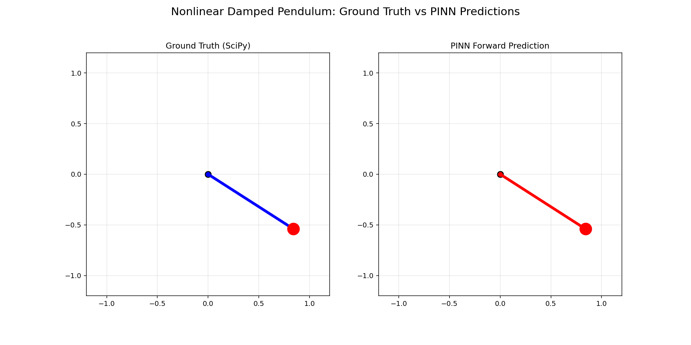
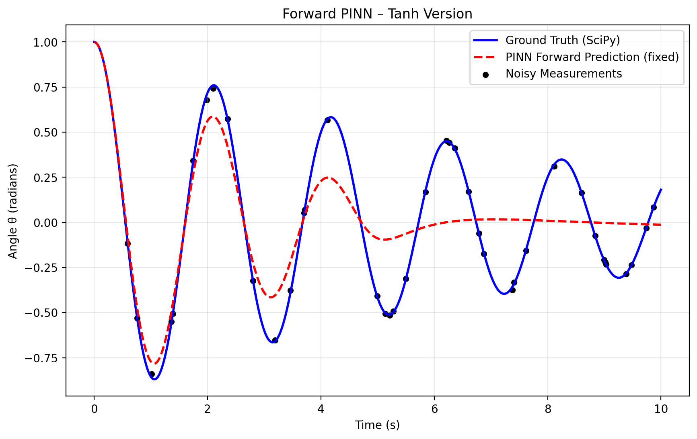
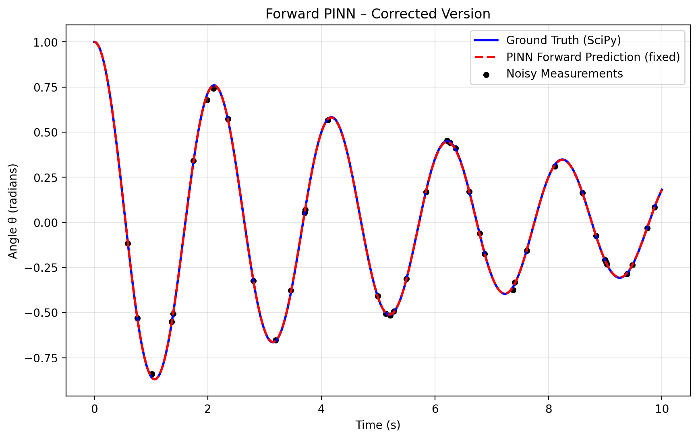
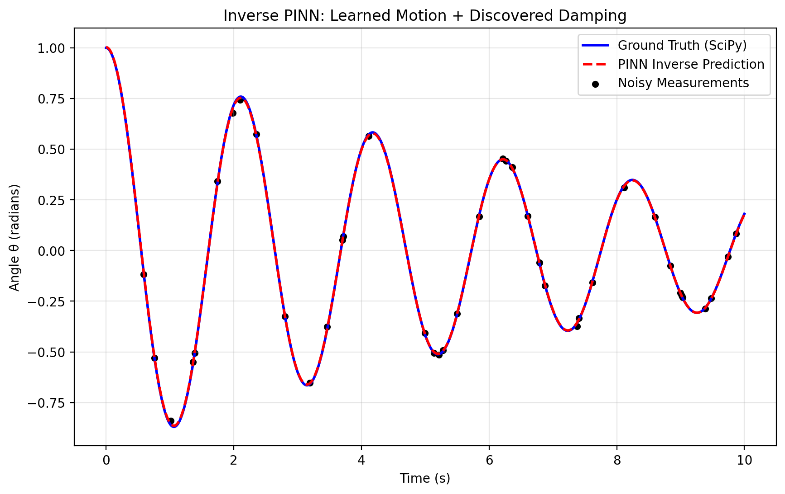
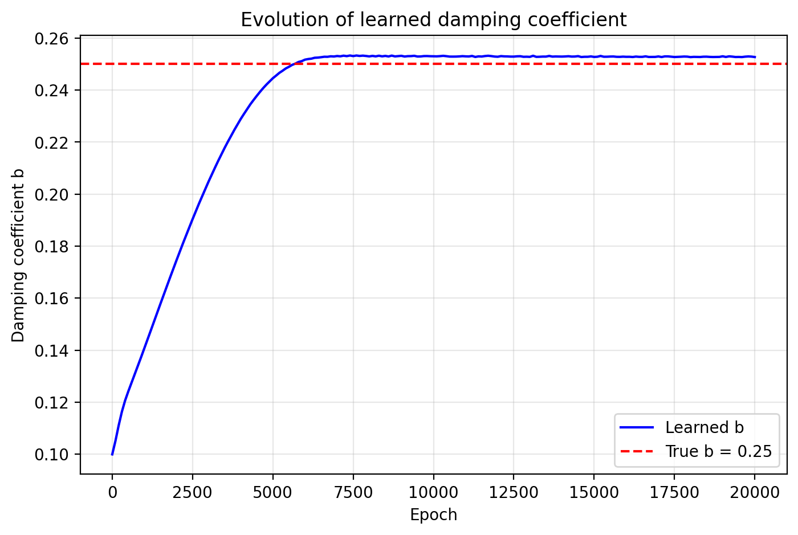

# Physics-Informed Neural Network for Nonlinear Damped Pendulum


## Overview
This project implements a **Physics-Informed Neural Network (PINN)** that solves the nonlinear damped pendulum ODE in two complementary ways:

- **Forward problem**: Predicts the full motion θ(t) when all physical parameters are known.
- **Inverse problem**: Discovers the unknown damping coefficient \( b \) from only 40 noisy measurements while strictly enforcing the physical law.

The project demonstrates how AI can embed physical laws directly into the loss function and recover hidden parameters, a frontier technique used in scientific machine learning research.

## Physics Background
The system is governed by the nonlinear damped pendulum equation:

  $$\frac{d^2\theta}{dt^2} + b \frac{d\theta}{dt} + \frac{g}{L}\sin\theta = 0$$
  
Where:
- $\frac{d^2\theta}{dt^2}$: angular acceleration
- $b$: damping coefficient (friction/air resistance; the unknown parameter in the inverse problem)
- $\frac{d\theta}{dt}$: angular velocity
- $g = 9.81$ m/s²: gravitational acceleration 
- $L = 1$ m: pendulum length 

Initial conditions: $\theta(0) = 1.0$ rad (~57°), $\frac{d\theta}{dt}$(0) = 0.

## Methodology
1. **Data generation**: Synthetic ground-truth trajectory generated with SciPy’s `solve_ivp`. 40 noisy measurements (2 % Gaussian noise) simulate real lab data.
2. **Neural network**: 4-hidden-layer MLP with sinusoidal (SIREN-style) activation and automatic differentiation to compute $\frac{d\theta}{dt}$ and $\frac{d^2\theta}{dt^2}$. ([models.py](models.py))
3. **Loss functions**: Physics residual + data fidelity + initial condition enforcement. ([losses.py](losses.py))
4. **Training**:
   - Forward: fixed $b = 0.25$, small data anchoring to avoid trivial solutions.
   - Inverse: $b$ is a learnable parameter; the network discovers its value from noisy data.

## Results - Forward Problem
Switching from Tanh to sinusoidal activation dramatically improved convergence and eliminated the common “trivial solution” problem (collapse to equilibrium).


**Final forward results** (after 15 000 epochs):
- Physics loss: ~1.5×10⁻⁴
- Excellent match to SciPy ground truth across the full 10 s interval.



A small data term (λ_data = 0.01) was used only to stabilize training.

## Results - Inverse Problem
The inverse PINN discovers the unknown damping coefficient while still obeying the ODE.

**Final inverse results** (after 20 000 epochs):
- Learned damping: \( b = 0.2527 \) (true value = 0.25)
- Relative error: **1.08 %**
- Motion prediction remains excellent despite noisy input data.




The parameter $b$ converged rapidly in the first ~2 000 epochs and then stabilized, with minor oscillations due to the 2 % measurement noise.

## Quantitative Metrics
| Metric                  | Forward Problem | Inverse Problem |
|-------------------------|-----------------|-----------------|
| Physics loss (final)    | 1.5×10⁻⁴        | 8.45×10⁻⁵       |
| Mean Absolute Error (θ) | ~0.001 rad      | ~0.002 rad      |
| RMSE (θ)                | ~0.002 rad      | ~0.003 rad      |
| Learned b              | 0.25 (fixed)    | ~0.2527         |
| b relative error        | -               | ~1.08 %         |

## How to Run
```bash
python data_generation.py
python train_forward.py
python train_inverse.py
```
## Future Work / Ablation Studies
* Test different network depths / widths
* Vary noise levels (1 % → 5 %)
* Compare Tanh vs. Sin activation quantitatively
* Add learning-rate scheduling and adaptive loss weighting
* Extend to double pendulum or chaotic regimes

## Acknowledgments / What I Learned
This project taught me how to embed physical laws into neural networks, 
handle inverse problems with noisy data, diagnose and fix common PINN failure modes 
(trivial solutions), and produce reproducible scientific ML research. 
It strengthened my skills in PyTorch, automatic differentiation, and computational physics.
